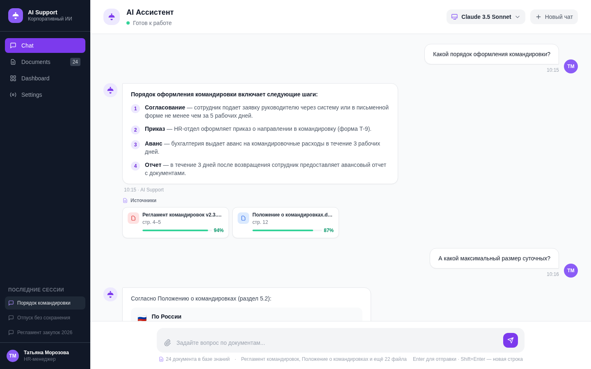

<!--
  BANNER: см. github_resume/DESIGN_SYSTEM.md — AI Support Agent
  Сохранить как assets/banner.png и раскомментировать:
-->
<!--  -->

<div align="center">

# AI Support Agent

### Enterprise AI Assistant with RAG & Knowledge Base
### Корпоративный AI-ассистент с RAG и базой знаний

[](https://github.com/AndrewSheff/ai-support-agent/actions)
[](https://python.org)
[](https://fastapi.tiangolo.com)
[](https://react.dev)
[](https://typescriptlang.org)
[](https://github.com/pgvector/pgvector)
[](https://docker.com)
[](LICENSE)

**Upload company documents. Employees ask questions. AI answers with exact source references.**

**Загрузите документы компании. Сотрудники задают вопросы. AI отвечает со ссылками на источники.**

[Quick Start](#-quick-start) · [Features](#-features) · [Screenshots](#-screenshots) · [Architecture](#-architecture) · [API](#-api-documentation)

</div>

---

> **The Problem:** Employees spend 5-8 hours per week searching for information in internal documents. New hires take 2-4 weeks to onboard. HR and legal answer the same questions repeatedly. Internal wikis become outdated and nobody trusts them.

> **Проблема:** Сотрудники тратят 5-8 часов в неделю на поиск информации во внутренних документах. Новички адаптируются 2-4 недели. HR и юристы отвечают на одни и те же вопросы. Внутренние вики устаревают и им никто не доверяет.

**AI Support Agent** is a self-hosted AI assistant that answers employee questions using your company's actual documents. Upload policies, manuals, and guides — the system builds a RAG pipeline with vector embeddings and provides precise answers with links to source documents.

<div align="center">

| Lines of Code | API Endpoints | DB Models | Pages | Tests | Docker Services |
|:---:|:---:|:---:|:---:|:---:|:---:|
| **9,500+** | **22** | **6 + pgvector** | **10** | **42** | **5** |

</div>

---

## Screenshots

| AI Chat with Sources |
|:--------------------:|
|  |

---

## Features

**AI Chat with Sources** — employees ask questions in natural language. The system searches relevant document chunks, builds context, and generates precise answers with citations pointing to exact source documents.

**Document Management** — upload PDF, DOCX, TXT files. Automatic text extraction, chunking, and vector embedding generation. Track processing status in real time.

**RAG Pipeline** — Retrieval-Augmented Generation: vector search finds relevant chunks, context window is built with metadata, LLM generates an answer grounded in actual documents.

**Conversation History** — maintains chat context within a session. Follow-up questions understand previous context. Full conversation log for admins.

**Semantic Search** — pgvector with HNSW indexing. Search by meaning across all documents. Cosine similarity ranking with relevance scores.

**Admin Dashboard** — document count, question volume, average relevance score. Monitor system usage and document coverage.

**Multi-Provider AI** — switch between OpenAI GPT and Anthropic Claude. Configure model, temperature, and system prompt from the admin panel.

**Role-Based Access** — User (chat only) and Admin (document management, settings, analytics) roles. JWT authentication with bcrypt.

**Enterprise Security** — rate limiting, CORS, structured JSON logging, request tracing. Self-hosted: your data stays on your servers.

---

## Architecture

```
┌──────────────────────────────────────────────────┐
│                    Nginx :80                      │
│               Reverse Proxy + Headers             │
├──────────────────┬───────────────────────────────┤
│  Frontend :3000  │        Backend :8000           │
│  React 19 + Vite │     FastAPI + Uvicorn          │
│  TailwindCSS v4  │     SQLAlchemy 2.0 (async)     │
│  Chat UI         │   ┌────────────────────────┐   │
│  10 pages        │   │     RAG Pipeline        │   │
│                  │   │  Upload → Chunk → Embed  │   │
│                  │   │  Search → Context → LLM  │   │
│                  │   └────────────────────────┘   │
├──────────────────┴───────────────────────────────┤
│   PostgreSQL 16 + pgvector       Redis 7          │
│   Vector Search (HNSW)           Rate Limiting    │
│   6 models, Alembic              Session Cache    │
└──────────────────────────────────────────────────┘
```

### RAG Flow

```
User asks a question
        |
        v
  [Generate question embedding]
        |
        v
  [pgvector: find top-K relevant chunks]
        |
        v
  [Build context window with metadata]
  [Document title, page number, chunk text]
        |
        v
  [LLM generates answer grounded in context]
        |
        v
  [Return answer + source references]
```

---

## Quick Start

### Prerequisites
- Docker & Docker Compose v2+
- OpenAI API key (required for embeddings)
- (Optional) Anthropic API key for Claude

### 1. Clone and configure

```bash
git clone https://github.com/AndrewSheff/ai-support-agent.git
cd ai-support-agent
cp .env.example .env
```

Edit `.env`:

```env
SECRET_KEY=your-random-32-char-string    # required
ADMIN_PASSWORD=SecurePass123             # required
OPENAI_API_KEY=sk-...                    # required for embeddings
ANTHROPIC_API_KEY=sk-ant-...             # optional
```

### 2. Launch

```bash
docker compose up -d
```

### 3. Access

| Service | URL |
|:--------|:----|
| Application | http://localhost |
| API Docs (Swagger) | http://localhost/docs |

Login with admin credentials. Upload documents, then switch to chat and ask questions.

---

## Tech Stack

| Layer | Technology | Version |
|:------|:-----------|:--------|
| **Backend** | Python, FastAPI, SQLAlchemy (async), Alembic | 3.13, 0.115, 2.0 |
| **Embeddings** | OpenAI text-embedding-3-small, pgvector (HNSW) | 1536 dims |
| **Frontend** | React, TypeScript, Vite, TailwindCSS, shadcn/ui | 19, 5+, 6, v4 |
| **Database** | PostgreSQL + pgvector | 16 |
| **Cache** | Redis | 7 |
| **AI** | Anthropic Claude, OpenAI GPT | Latest |
| **Auth** | JWT + bcrypt | HS256 |
| **Infra** | Docker Compose, Nginx, GitHub Actions CI/CD | Multi-stage |
| **Logging** | structlog (JSON) | Request tracing |
| **Testing** | Pytest (async) | 42 tests |

---

## API Documentation

Interactive Swagger at `/docs`. **22 endpoints** across 6 groups:

| Group | Prefix | Endpoints |
|:------|:-------|:----------|
| Auth | `/api/v1/auth` | Register, login, profile |
| Chat | `/api/v1/chat` | Ask questions, conversation history |
| Documents | `/api/v1/documents` | Upload, list, delete, reprocess |
| Search | `/api/v1/search` | Semantic search across documents |
| Dashboard | `/api/v1/dashboard` | Usage stats and analytics |
| Health | `/api/v1/health` | Liveness probe |

---

## Project Structure

```
ai-support-agent/
├── backend/
│   ├── app/
│   │   ├── main.py              # FastAPI app with lifespan
│   │   ├── config.py            # Pydantic settings
│   │   ├── database.py          # Async SQLAlchemy + pgvector
│   │   ├── api/v1/              # 6 REST API routers
│   │   ├── models/              # 6 SQLAlchemy models
│   │   ├── schemas/             # Pydantic v2 schemas
│   │   ├── services/            # RAG, embedding, AI, search
│   │   └── core/                # Security, logging
│   ├── tests/                   # 42 pytest tests
│   ├── alembic/                 # Migrations
│   └── Dockerfile
├── frontend/
│   ├── src/
│   │   ├── api/                 # Axios clients
│   │   ├── components/          # Chat UI + layout
│   │   ├── contexts/            # Auth context
│   │   ├── pages/               # 10 page components
│   │   └── lib/                 # Utilities
│   └── Dockerfile
├── docker/nginx/
├── .github/workflows/           # CI/CD
├── docker-compose.yml           # 5 services
└── .env.example
```

---

## Environment Variables

| Variable | Required | Default | Description |
|:---------|:---------|:--------|:------------|
| `SECRET_KEY` | Yes | -- | JWT signing key |
| `ADMIN_PASSWORD` | Yes | -- | Initial admin password |
| `OPENAI_API_KEY` | Yes | -- | For embeddings + optional chat |
| `ANTHROPIC_API_KEY` | No | -- | For Claude |
| `DATABASE_URL` | No | Auto | PostgreSQL connection |
| `REDIS_URL` | No | Auto | Redis connection |
| `LOG_LEVEL` | No | `INFO` | Logging verbosity |

---

## Development

```bash
# Backend
cd backend
python -m venv .venv && source .venv/bin/activate
pip install -r requirements.txt
docker compose up -d postgres redis
alembic upgrade head
uvicorn app.main:app --reload --port 8000

# Frontend
cd frontend && npm install && npm run dev

# Tests
cd backend && pytest tests/ -v

# Lint
ruff check backend/
cd frontend && npm run lint && npx tsc --noEmit
```

---

## License

[MIT](LICENSE) — free for commercial use.
